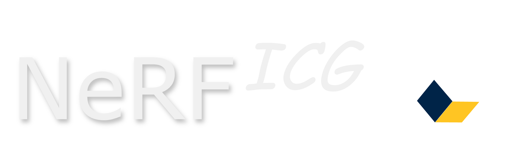

<!--  -->


<!-- ---
# NeRFICG -->

&nbsp;&nbsp;[](./LICENSE)

A flexible PyTorch framework for simple and efficient implementation of radiance field and view synthesis methods, including a GUI for interactive rendering.

<div class="image-row">
<a href="resources/teaser_videos/inpc.mp4">
	
</a>
<a href="resources/teaser_videos/dnpc.mp4">
	
</a>
</div>


## Getting Started

**Requirements:** Our framework requires Linux (preferred) or Windows as well as a reasonably recent NVIDIA GPU.

- Install a CUDA SDK (we recommend [CUDA Toolkit 12.8](https://developer.nvidia.com/cuda-12-8-0-download-archive)) and a compatible C++ compiler.
  Depending on your system there are some additional steps required to make sure everything is set up correctly.
    - Linux: Make sure the CUDA SDK is correctly installed and added to your environment variables.
      On Ubuntu, we usually add the following lines to the top of our `.bashrc` file for CUDA 12.8:
        ```shell
	    export PATH="/usr/local/cuda-12.8/bin:$PATH"
	    export LD_LIBRARY_PATH="/usr/local/cuda-12.8/lib64:$LD_LIBRARY_PATH"
	    export CUDA_PATH="/usr/local/cuda-12.8/"
	    ```
    - Windows: Coming soon ...

- This repository uses submodules, clone using one of the following options:
	```shell
	# HTTPS
	git clone https://github.com/nerficg-project/nerficg.git --recursive ./nerficg && cd nerficg
	```
	or
	```shell
	# SSH
	git clone git@github.com:nerficg-project/nerficg.git --recursive ./nerficg && cd nerficg
	```

- Set up a Conda environment that contains all dependencies using:
	```shell
    SET DISTUTILS_USE_SDK=1  # Windows only
    conda env create -f ./environments/py311_cu128.yaml
    conda activate nerficg
	```
  Depending on your system and goals, you might want to install a different environment.
  We provide multiple options in the `environments` directory.
  For example, if you plan on using our COLMAP script (see [below](#Training-on-Custom-Image-Sequences)), you would want to use an environment file with the `_with_colmap` suffix.

- To install all additional dependencies for a specific method, run:
	```shell
	python ./scripts/install.py -m <METHOD_NAME>
	```
	or use
	```shell
	python ./scripts/install.py -e <PATH_TO_EXTENSION>
	```
	to only install a specific extension.

- [optional] To use our training visualizations with [Weights & Biases](https://wandb.ai/site), run the following command and enter your account identifier:
	```shell
	wandb login
	```


## Creating a Configuration File

To create a configuration file for training, run
```
python ./scripts/create_config.py -m <METHOD_NAME> -d <DATASET_TYPE> -o <CONFIG_NAME>
```
where `<METHOD_NAME>` and `<DATASET_TYPE>` match one of the items in the `src/Methods` and `src/Datasets` directories, respectively.
The resulting configuration file `<CONFIG_NAME>.yaml` will be available in the `configs` directory and can be customized as needed.
To create a directory of configuration files for all scenes of a dataset, use the `-a` flag. This requires the full dataset to be available in the `dataset` directory.


## Training a New Model

To train a new model from a configuration file, run:
```
python ./scripts/train.py -c configs/<CONFIG_NAME>.yaml
```
The resulting images and model checkpoints will be saved to the `output` directory.

To train multiple models from a directory or list of configuration files, use the `scripts/sequential_train.py` script with the `-d` or `-c` flag respectively.


## Training on Custom Image Sequences

If you want to train on a custom image sequence, create a new directory with an `images` subdirectory containing all training images.
Then you can prepare the image sequence using the provided [COLMAP](https://colmap.github.io) script, including various preprocessing options like monocular depth estimation, image segmentation and optical flow.
Run
```
python ./scripts/colmap.py -h
```
to see all available flags and options.

After calibration, the custom dataset can be loaded by setting `Colmap` as `GLOBAL.DATASET_TYPE` in the config file and entering the correct directory path in the config file under `DATASET.PATH`.


## Inference and Evaluation

We provide multiple scripts for easy model inference and performance evaluation after training.
Use the `scripts/inference.py` script to render output images for individual subsets (train/test/eval) or custom camera trajectories defined in `src/Visual/Trajectories` using the `-s` option.
Additional rendering performance benchmarking and metric calculation is available using the `-b` and `-m` flags respectively .

The `scripts/generate_tables.py` script further enables consistent metric calculation over multiple pre-generated output image directories (e.g. to compare multiple methods against GT), and automatically generates LaTeX code for tables containing the resulting values.
Use `-h` to see the available options for all scripts.


## Graphical User Interface

To inspect a pretrained model in our GUI, make sure the GUI submodule is initialized, run
```
python ./scripts/gui.py
```
and select the generated output directory.

Some methods support live GUI interaction during optimization. To enable live GUI support, activate the `TRAINING.GUI.ACTIVATE` flag in your config file.


## Frequently Asked Questions (FAQ)

__Q:__ What coordinate system do the framework and GUI use internally?

__A:__ Framework and GUI use the same right-handed coordinate system for world and camera space in all calculations.
The convention is the same as in, e.g., COLMAP, meaning x is right, y is down, and z is forward.

##
__Q:__ Can I use the modules in the `src/CudaUtils` directory outside of the NeRFICG framework?

__A:__ Yes! For example, to install the `MortonEncoding` module via pip, simply run
```shell
pip install git+https://github.com/nerficg-project/nerficg/#subdirectory=src/CudaUtils/MortonEncoding --no-build-isolation
```

## Acknowledgments

We started working on this project in 2021. Over the years many projects have inspired and helped us to develop this framework.
Apart from any reference you might find in our source code, we would specifically like to thank all authors of the following projects for their great work: 
- [NeRF: Neural Radiance Fields](https://github.com/bmild/nerf)
- [NeRF-pytorch](https://github.com/yenchenlin/nerf-pytorch)
- [Instant Neural Graphics Primitives](https://github.com/NVlabs/instant-ngp)
- [ngp_pl](https://github.com/kwea123/ngp_pl.git)
- [MultiNeRF: A Code Release for Mip-NeRF 360, Ref-NeRF, and RawNeRF](https://github.com/google-research/multinerf)
- [torch_efficient_distloss](https://github.com/sunset1995/torch_efficient_distloss)
- [3D Gaussian Splatting for Real-Time Radiance Field Rendering](https://github.com/graphdeco-inria/gaussian-splatting)
- [CamP Zip-NeRF: A Code Release for CamP and Zip-NeRF](https://github.com/jonbarron/camp_zipnerf/)
- [ADOP: Approximate Differentiable One-Pixel Point Rendering](https://github.com/darglein/ADOP)


## License and Citation

This framework is licensed under the MIT license (see [LICENSE](LICENSE)).

If you use it in your research projects, please consider a citation:
```bibtex
@software{nerficg,
	author = {Kappel, Moritz and Hahlbohm, Florian and Scholz, Timon},
	license = {MIT},
	month = {2},
	title = {NeRFICG},
	url = {https://github.com/nerficg-project},
	version = {2.0},
	year = {2026}
}
```